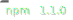
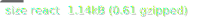

# [SmolScr🐶ll](https://github.com/smolscrolljs/smolscroll)

Tiny, flexible scroll listener with React support

## Features

- 🦻🏼 Sets up a passive scroll listener
- 🪟 Accepts document & elements as scroll containers
- 🔭 Iterates elements and only invokes transforms from those in the viewport
- 👨‍👦 Handles browser resize events and updates the cached properties
- 🗑 Passive garbage collection of removed elements
- ⏲ Includes timing functions to calculate relative distances between the screen and the original element position
- 📦 Caches original size and position of your elements
- 🖌 Basic server side rendering support

**Give it a try**: [Codesandbox](https://codesandbox.io/s/musing-http-nzuvw?file=/src/App.js)

---

[](https://opensource.org/licenses/MIT)
[](https://www.npmjs.com/package/smolscroll)
[](https://prettier.io/)
<br>




---

## Core

The core of the library is about registering scroll / resize event handlers, caching element sizes and positions and transforming elements in the viewport.

Usage:

```jsx
import { smol } from 'smolscroll';

const scroll = smol();

// Register an element which should be cached and transformed
scroll.add({
  el: document.querySelector('.title'),
  // i = ScrollItem { el, width, height, x, y ... }
  // s = Screen { width, height, x, y ... }
  transform: function(i, s) {
    // Use your creativity and create amazing effects
    i.el.style.opacity = Math.random()
  }
});

// Alternative method with a directly integrated querySelectorAll
scroll.addWithSelector('.title-2', {
  transform: function(i) {
    i.el.style.color = '#' + Math.round(Math.random() * 1000);
  }
})

// Attach event listeners to the document
scroll.mount();

// You can also register elements after the mount
scroll.add(...);
```


### Animations, Element position and size

Animations usually are described with a time value "t" from 0-1. Usually this time is calculated based on the **distance** between the viewport y/x position and the element y/x position.

As you transform your element while scrolling, this normally would break the time value as the transformations could have an effect on the **distance**.

SmolScroll solves this with a "smol" wrapper element which will stay at the original position, with the original size. SmolScroll automatically wraps your element with a `<div class="smol">`, unless the parent of your element already is an element with the class `smol`.

The first argument `ScrollItem` of your transform function includes the memoized width/height/etc. values of the wrapper element **and not your added one**.

When you create an animation effect you have to think about, if it could mess with the time calculation, basically you should only change css properties not having layout side-effects. Ideal css animation candidates are `transform` and `opacity`.

### Browser support

At the moment the library was not yet explicitly tested on specific browsers, but it uses a couple modern browser features like:

- [Window.requestAnimationFrame](https://developer.mozilla.org/en-US/docs/Web/API/window/requestAnimationFrame)
- [Node.isConnected](https://developer.mozilla.org/en-US/docs/Web/API/Node/isConnected)

### Mounting to an element instead of the document

```jsx
smol.mount(document.querySelector(".custom-scroll-container"));
```

Make sure your custom scroll container has `overflow: scroll`.

## React module

Example:

```jsx
import { useSmol, SmolItem, useScrollMount } from "smolscroll/react";

const transform = (i, s) => {
  i.el.style.opacity = Math.random();
};

export const App = () => {
  // false is only needed if you use useScrollMount
  const smol = useSmol(false);

  // Only needed if you want to mount smol to a virtual element
  const containerRef = useScrollMount(smol);

  return (
    <div
      style={{ overflow: "scroll", width: "1100px", height: "500px" }}
      ref={containerRef}
    >
      <SmolItem transform={transform} smol={smol}>
        <div style={{ backgroundColor: "red", height: "1000px" }} />
      </SmolItem>
    </div>
  );
};
```

## Time module

SmolScroll includes a "time" module with several useful timing and easing related functions.

It includes the easing functions from [d3-ease](https://github.com/d3/d3-ease)

Example transform function:

```jsx
import { timeToCenterHalf } from "smolscroll/time";

const transform = (i, s) => {
  // t is a value from 0.0 to 1.0
  const t = timeToCenterHalf(true, i, s, -s.height / 2, s.height * 2);

  i.el.style.transform = `translateX(${t * 500}px`;
};
```

Some of the included time functions:

- time
- timeToHalf
- timeToCenter
- timeToCenterHalf

Time functions arguments:

```jsx
const transform = (i, s) => {
  // By default the distance will be calculated on the y axis.
  // Set this to false, to calculate the x axis
  const isYDistance = true;

  // Add an optional offset, basically resulting in the timing to start processing from 0 to 1 earlier or later
  // This example makes it, so that the distance is calculated from the screen center, instead of the top screen edge
  const offset = -s.height / 2;

  // Optional distance parameter (default: depending on the axis screen.width or screen.height)
  // This defines how far the user has to scroll to get from t 0 to 1
  const distance = 400;

  const t = time(isYDistance, i, s, offset, distance);
};
```

### Time functions visually explained


## Server side rendering

On the server, the functions of the core will literaly do nothing, so event listeners are not attached, no DOM related actions are triggered. Therefore you can prerender a scrollable component on the server, without worrying about DOM mutations.

Obviously in this way, you have to make sure that your components are later hydrated on the client!
